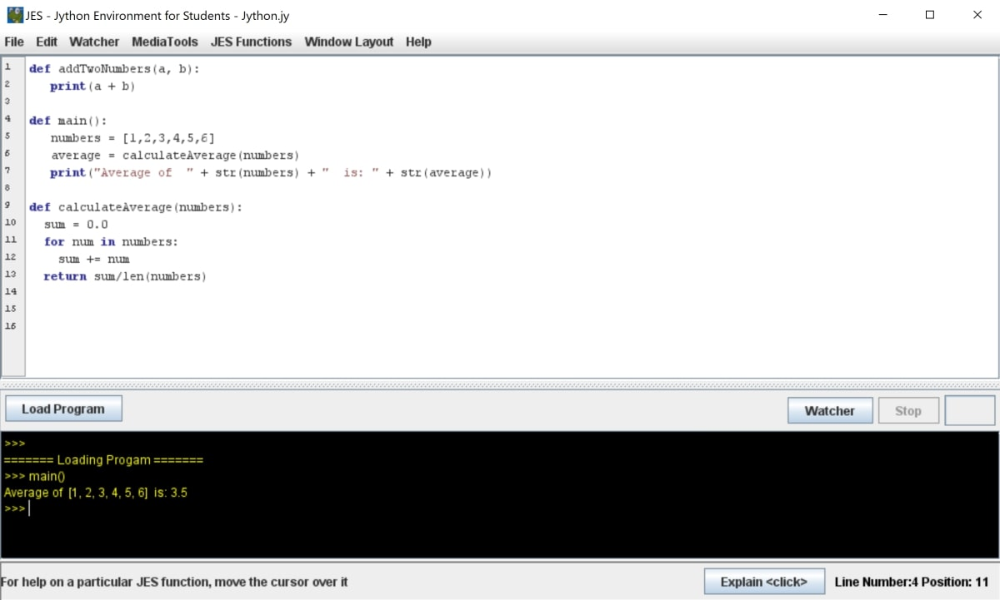

# jes-jython-program
This is a simple program made in JES/Jython.
It adds the sum of 2 numbers, and also calculates the average of a list of numbers.

## Prerequisites 

* Make sure you have JES installed on your computer.
* You can install JES from [here](code.google.com/archive/p/mediacomp-jes/downloads). 

## To Run

* Open the JES software on your computer.
* Go to File > Open Program  
* Navigate to where your .jy file is stored
* Click on the .jy file to open the program

## Example

